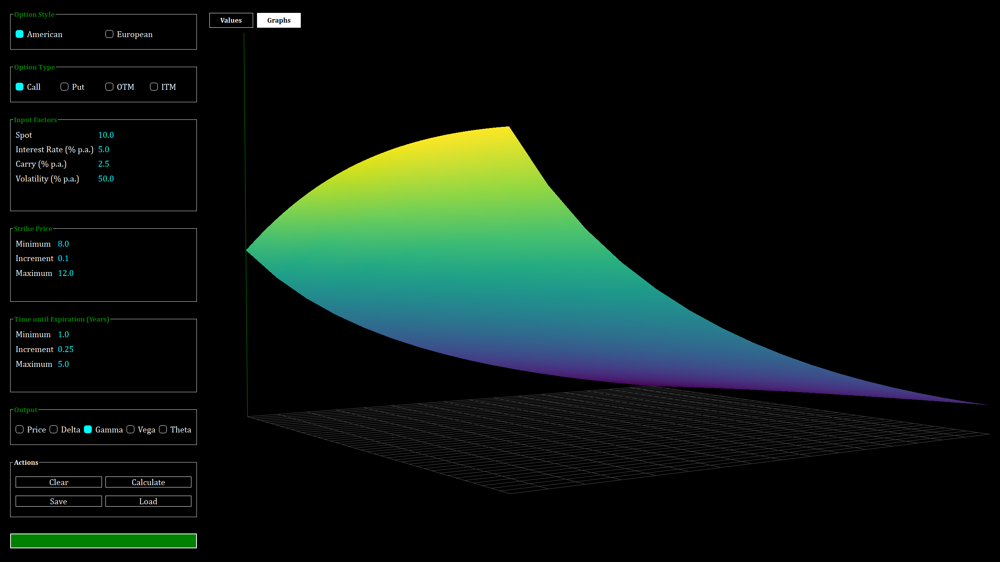
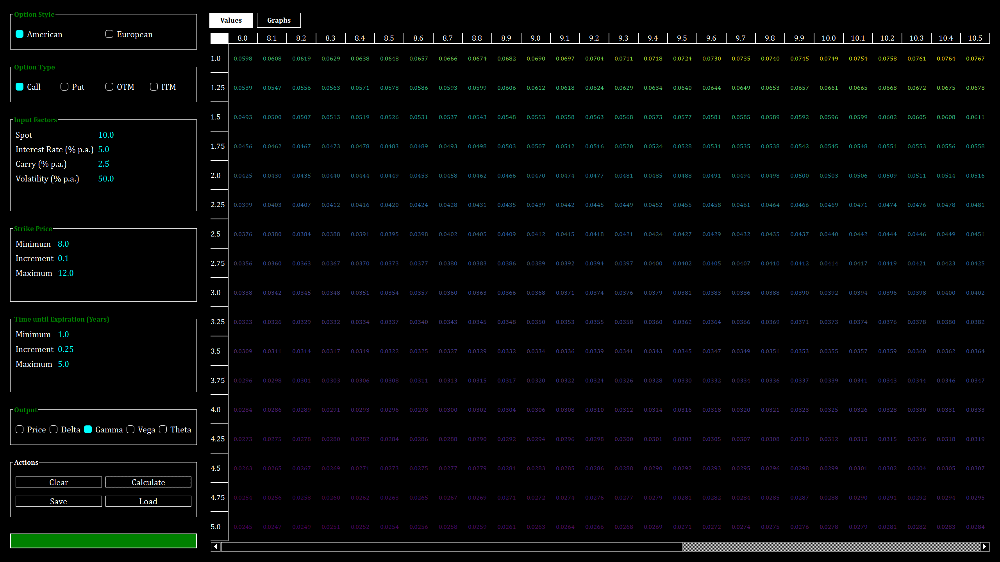
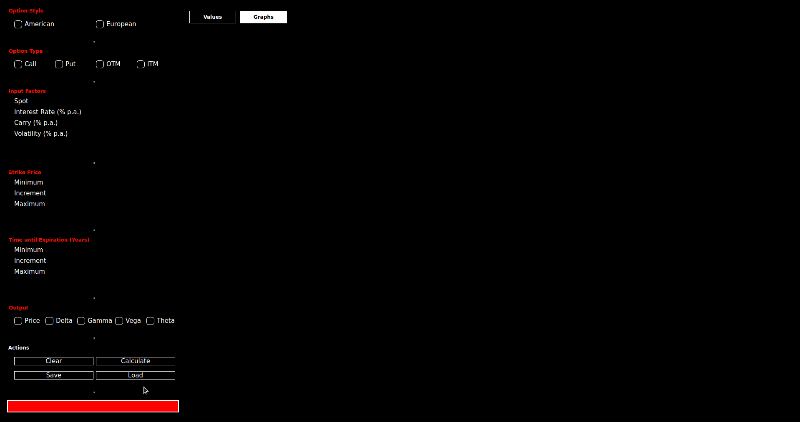

# DeriVAT (Derivative Visual Analysis Tool)

Desktop application for theoretical visualization of financial derivatives, using PyQT, Cython, and OpenGL.





## Getting Started

To run the application, 

1.Verify working installation of _Python 2.7_ with _pip_ and (optionally) _virtualenv_ packages installed
2\. Clone the repository

```shell
$ git clone https://github.com/rwev/derivat.git
```

3.  Navigate to the repository with CLI
    ```shell
    $ cd derivat
    ```

4.  Create an isolated virtual environment (optional, but recommended)
    ```shell
    $ virtualenv <name>
    ```
    This is to mitigate version conflicts with the global system Python installation. This project intentionally relies on some former package versions.

5.  Install dependencies

    **Windows:**

    _PyQt4_: download the Windows wheel (_.whl_) file [here](https://www.lfd.uci.edu/~gohlke/pythonlibs/#pyqt4) (be sure to select _cp27_ for Python 2.7) and and manually install:

    ```shell
    \derivat > pip install PyQt4-4.11.4-cp27-<bit-system>.whl
    ```

    All other dependencies can be automatically installed with

    ```shell
    \derivat > pip install -r requirements.txt
    ```

    **Linux:**

    ```shell
    /derivat $ sudo apt-get install python-qt4 python-qt4-gl python-tk
    /derivat $ pip install -r requirements.txt --user
    ```

6.  Compile Cython valuation module with the following command. 
    ```shell
    /derivat $ python ./components/libs/setup.py build_ext --inplace
    ```
    **Note**: On Windows, this step requires a working installation of [VCforPython27, Microsoft Visual C++ Compiler for Python 2.7](https://www.microsoft.com/EN-US/DOWNLOAD/DETAILS.ASPX?ID=44266) 

7.  Execute
    ```shell
    /derivat $ python derivat.py 
    ```

### Controls

The 3D visualization on the **Graphs** tab can be manipulated with the following interactions:

-   **Left button drag**: Rotates the scene around central focus point
-   **Middle button drag**: Pan the scene by moving the central look-at point within the x-y plane
-   **Middle button drag + CTRL**: Pan the scene by moving the central look-at point along the z axis
-   **Wheel spin**: zoom in/out
-   **Wheel + CTRL**: change field-of-view angle

## Contribution

To-date development has been done with the assistance of a custom execute-on-change tool [resurgence.py](https://gist.github.com/rwev/cb5d117c9dbe0efb923e4bb1ed3619f0). 

### Setting up resurgence.py

For development is VSCode, the following "Run" configuration can be used:

```javascript
    {
        "name": "Python: Resurgence",
        "type": "python",
        "request": "launch",
        "program": "${path}/resurgence.py",
        "args": [
            "--cwd",
            "--extensions=*.py",
            "--dirs=./components", 
            "--command=${path}/derivat/python.exe derivat.py"
        ],
    }
```

Or simply start the following process in your terminal:

```shell
$ python resurgence.py --cwd --extensions=*.py --dirs=./components
--command=python derivat.py
```

While running this configuration, a change of one of the _.py_ source files in either the project directory or the _components/_ subdirectory will trigger a forceful restart of the _python derivat.py_ process. 

Resurgence thus shortens the visual feedback loop in the development of GUI applications like _derivat.py_. However, debugging with _resurgence.py_ isn't possible, because it spawns a child process. 

See _python resurgence.py --help_ or read the source for more details on this mechanism. 

### Debug Configuration

To debug _derivat.py_ in VSCode, specify a debug configuration that starts execution of _derivat.py_ directly.

```javascript
        {
            "name": "Python: derivat",
            "type": "python",
            "request": "launch",
            "program": "${workspaceFolder}/derivat.py"
        }
```

## TODO

-   [ ] lock save, calculate buttons 
    -   [ ] when at least one input section isn't valid
    -   [ ] after calculation when same (valid) inputs remain
-   [ ] add axis labels 
-   [ ] add mesh to value surface
-   [ ] add ability to further specify axis, instruments
    -   [ ] e.g. time on one axis, underlying price on another, holding the instrument constant
    -   [ ] custom instruments as a combination of vanilla options
-   [ ] refactor display constants / serialization path mechanism 
